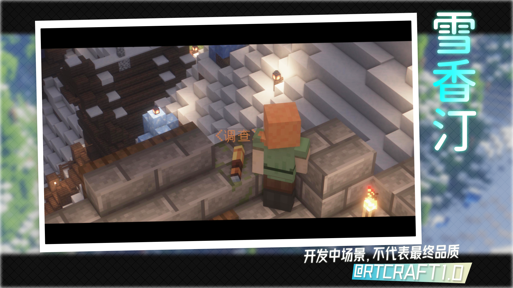
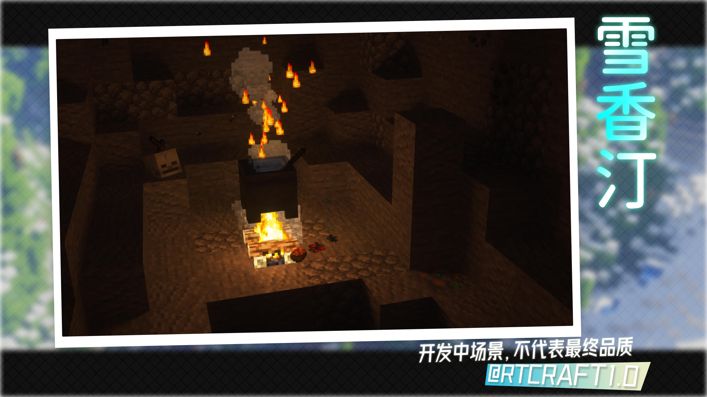
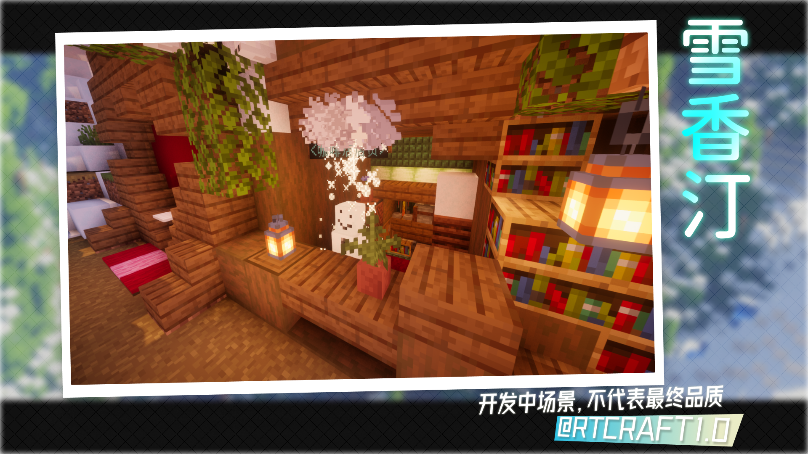
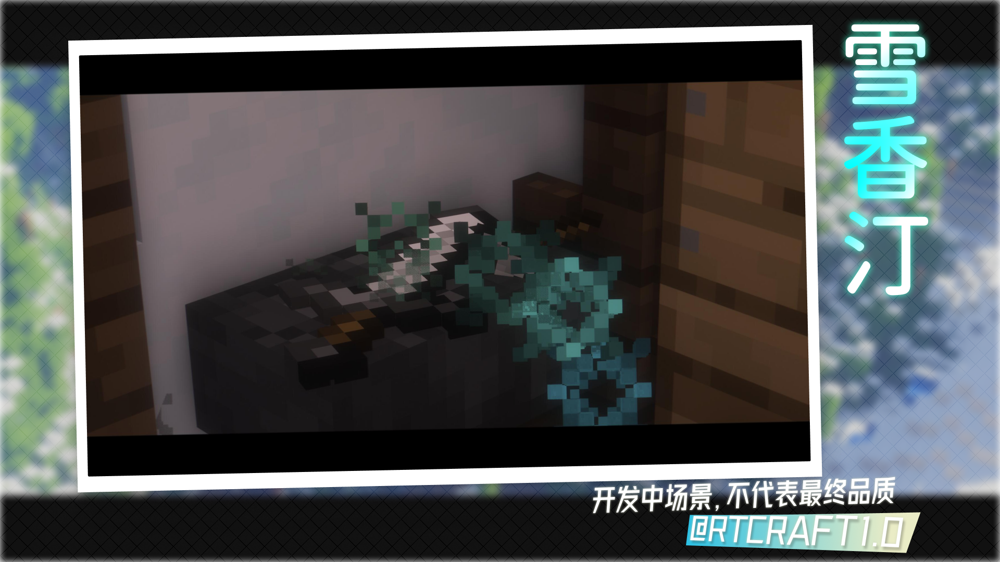
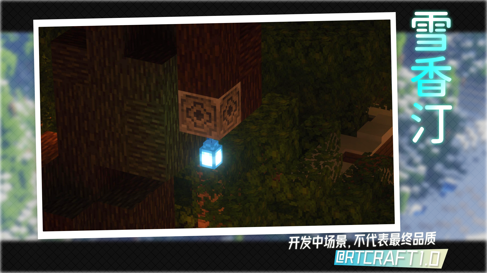
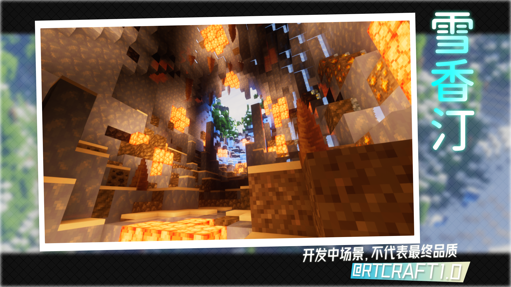

# 亲爱的拾荒者们，我们的拾荒之旅即将开始
> 为了让各位拾荒者提前熟悉地图环境，奈丸岛最快速的 **「莱德快报」** 为各位拾荒者送上第一手情报

##  孤独港湾——雪香汀瞭望塔（守卫塔） 

哇！看到了吧，这就是雪香汀的瞭望塔。在这里你可以观览整个镇子的情况，帮助守卫及时发现危情。据说有的人也在这个简单的望远镜里看到的不得了的东西
 
## 怪物炖锅 

这就是雪香汀周围的怪物部落，这里有一口神奇的大锅，据说从雪香汀建成至今这口大锅仍在不停的燃烧，为附近的怪物提供食物和一个安身的地方但是说不定你未来也会经常来到这里呢？
 
## 雪人商贩 （饮品店） 

不是我吹啊，这家饮品店卖的饮料是我喝过最好喝的饮料之一，但也是我喝过最难喝甚至于最痛的饮料之一了。如果各位拾荒者能够合理利用「奇怪雪人」先生所制的饮品那一定你对你的冒险提供不少帮助

## 商旅神奇铁砧 

据说拾荒者协会的二楼有一家不起眼的商铺正在悄悄的开张，你若问我为何是悄悄的，或许是因为店主记性不好总是忘记委托而让人无言以对、亦或者伪劣的商品。但是一个商铺总不可能没有一点优秀的地方，我想也就只有店主的「制造能力」了，瑞商旅制造的武器几乎是全世界最耐用的，因为瑞商旅总有一个魔法铁砧，可以让制造的东西更加耐用？
 
## 千年古树等待开花

雪香汀的正中间有一个巨大的无叶树木，老一辈的人们都说雪香汀的深邃都是「神树」带来的。而神树指的就是这个树。

## 坠星山洞

曾经有人说过「天空中一道白光闪过，山洞里顿时发出巨大白光持续了几秒便熄灭了」，正如你一样拾荒者突然从世界出现然后惊叹世界。 
 

好啦，今天的所有的情报已经分享到这里结束啦！欢迎各位关注我们！ 


