## 插件介绍




✅游戏内用户界面 ，充当视频编辑程序，您可以使用该程序创建电影过场动画。

✅所有实体类型都支持作为 过场动画的NPC！

✅ 这些实体的动作捕捉。记录自己表演NPC的动作和动作。

✅流畅的相机移动 ！使用游戏内 UI 创建点对点扫描摄像机镜头。控制摄像机的移动速度。

✅瞬间瞬移！ 如果您想在不移动摄像机的情况下更改场景，您还可以立即传送相机。

✅影响！ 使闪电击中某个点或播放粒子效果。甚至可以在过场动画中专门为玩家更改天气和一天中的时间！

✅消息、标题、操作栏和命令

✅听 起来！ 使用游戏内UI，您可以轻松地为过场动画添加声音效果。还支持自定义资源包声音。

✅暴徒专属行动！ 马可以跳跃，狐狸可以蜷缩着睡觉，蝙蝠可以挂在块上。其中许多生物独占操作都受支持，并且可以在运动捕获中使用。

✅区域触发器！ 当玩家进入某个区域时触发过场动画。是否有人可以多次体验过场动画取决于您。

✅自定义命令触发器！ 希望您的玩家能够运行自定义命令（例如 /tutorial）来查看您的过场动画？然后继续添加它。您可以确定每个过场动画的命令应该是什么。此命令也可以在命令块中使用。

✅在加入触发器上！ 想要在玩家首次登录时播放某个过场动画？确定！这可能非常适合服务器介绍之旅，给玩家留下良好的第一印象。

✅实时查看/编辑过场动画！

✅所有客户端！ 过场动画仅对当前用户可见，其他玩家看不到。

✅开发者接口 




## 维基简介
本维基仍在建设中。
Cinematic Studio是一款功能强大的工具，可以让您创建复杂的电影场景。
由LoneDev制作的高级场景工具（最初由CraterHater制作）。
它允许您创建**平滑的摄像机路径**，从而可以创建风景或NPC场景的扫射镜头。
该插件允许您在您的场景中拥有无限量的角色。
这些角色可以是任何类型的，并且可以通过**动作捕捉系统**制作动画。
这意味着您可以对NPC的行为进行表演，以赋予他们您想要的准确动作。

如需快速展示，请查看插件页面描述中的示例场景。

**这个插件其实很容易理解，所以最好的学习方法就是在游戏中使用编辑器！**

## ⚙ 第一次安装

* 安装插件

* 安装[Lonelibs](https://www.spigotmc.org/resources/lonelibs.75974/)

* 安装[ProtocolLib](https://ci.dmulloy2.net/job/ProtocolLib/lastSuccessfulBuild/)

## 命令和权限
### 帮助

> **/cinematic help [页码］**
>
>`cinematicstudio.command.admin.help`


允许您查看所有命令


### 编辑器

> **/cinematic edit <cinematic>**
>
>`cinematicstudio.command.admin.edit`


打开游戏中的剪辑编辑器。


### 播放

> **/cinematic play [player]**
>
>`cinematicstudio.command.admin.play`


播放特定场景。可以选择播放给其他玩家。

### 暂停

> **/cinematic pause**
>
>`cinematicstudio.command.admin.pause`


暂停当前正在播放的场景，允许您进行更改。

### 恢复

> **/cinematic resume**
>
>`cinematicstudio.command.admin.resume`


恢复刚才暂停的场景。

### 停止

> **/cinematic stop**
>
>`cinematicstudio.command.admin.stop`


停止正在播放的场景。

### 输入

> **/cinematic input [input]**
>
>`cinematicstudio.command.admin.input`

## 界面
本维基仍在建设中。

该插件的所有配置都通过箱子菜单进行，可以通过编写 **/cinematic edit** 进行访问。
打开箱子菜单后，您可以点击剪辑项目，进入剪辑选项卡。该选项卡将显示您制作的所有场景，并允许您编辑这些场景或创建新场景。
点击绿宝石创建一个新的场景。它会要求您给它起个名字，请在聊天中回答。这个名字仅供您参考，不会显示给任何玩家。在您创建了第一个场景后，您将被发送到最重要的箱子菜单。时间轴。把它想象成一个视频编辑软件的时间轴，您可以在这里添加事件、剪切事件和更改事件。

### 时间轴
这是所有重要编辑发生的地方。每一行代表一个剪辑场景的不同方面。从上到下依次为 时间、镜头、NPC、特效和声音。要播放剪辑，请按**底部的播放图标**。
要删除场景，请按红色方块。(如果您不小心按下，会出现 "您确定吗？）
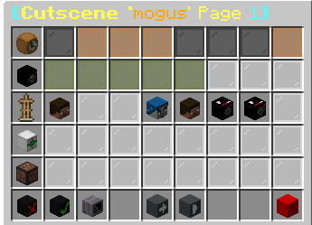

### 第1行：时间
了解场景是如何播放的非常重要。一旦您开始一个场景，它将从左到右执行动作。您可以有多个页面来制作更长的场景。一旦播放到某个箱子菜单槽，例如，它可能会生成一个NPC。您可以点击一个黑色的彩色玻璃物品来给它一个值，来决定它应该等待多长时间才继续下一个插槽。这个值将是场景在继续之前等待的时间（以秒为单位）。这样您就可以在每个事件之间设定时间间隔。如果您不使用该值，那么所有事件都将在完全相同的时间播放。如果您中键点击任何节点，您可以在剪辑中添加额外的一排节点，试试看吧，当您想在剪辑中间添加额外的东西时，它会很有意义并且很方便。
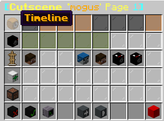

### 第2行："摄像机"
这一行用于控制摄像机的移动。如果你不需要任何东西，那么就把这一行留空。如果您想创建一个新的摄像机位置，只需点击其中一个节点并回答聊天中提出的问题即可。接下来，在第1行添加延迟，然后添加另一个摄像机位置。记住添加最后的定时节点，以防止在摄像机移动结束前结束剪辑。
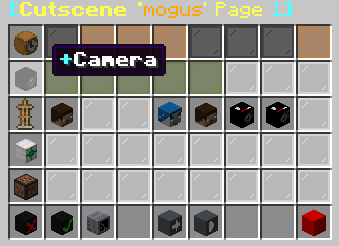
### 第3行："角色
这是有趣的一行。在这里您可以控制生成的角色（NPC）。点击其中一个节点开始。当您点击其中任何一个节点时，它会询问您是要编辑现有的NPC还是要生成一个新的NPC。然后它会将您发送到新NPC自定义菜单。
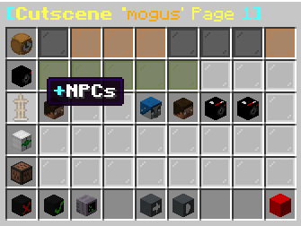

### 第4行和第5行："效果和声音"
这两行允许您添加特效，如信息、粒子或时间变化。声音选项卡允许您查看所有音效，以便将其添加到场景中。


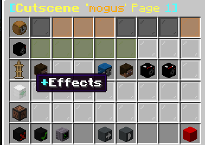
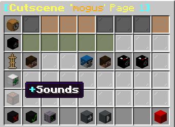


### 如何触发场景？
有许多选项可供您触发这些场景。我将逐一介绍。要进入配置菜单，请进入场景的时间轴。这是场景的主页面，点击最下面一行写着 "场景触发器 "的空地图项。它会将您发送到下面的箱子菜单：
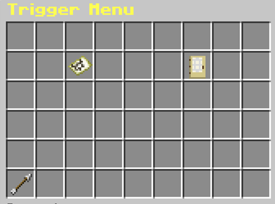
在这里你有三个选项：
#### 选项1：区域触发器：
如果你点击这个项目，它会要求你定义一个区域的角。这两个角会形成一个立方体。如果玩家进入立方体，将播放该玩家的剪辑。第三个问题是该场景是否可以多次播放。如果您写的是 "否"，那么该区域只能为每个玩家触发一次场景。如果您的答案是 "是"，那么每次玩家进入时，该场景都会开始。右键单击该项删除该区域。
#### 选项2：加入时播放：
如果您点击该项，您可以在三种状态之间切换： 否"、"每次 "和 "一次"。否 "表示玩家加入时不会播放剪辑。Everytime "表示每次玩家登录时都会播放该场景，"once "表示只有当玩家第一次登录服务器时才会播放该场景。

## 场景示例

以下是如何快速制作剪切场景的分步指南。详细说明请参阅文档。

### 第一步
 使用 `/cinematic edit` 命令打开编辑器。
### 第二步
创建一个新的场景并为其命名。
### 第三步
现在您已进入编辑器！点击第一行的第一个节点，该节点前面有一个摄像机图标。
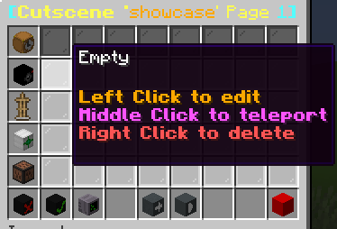
### 第四步
现在走到你想要摄像机的位置。您可以使用观众模式来获得更精确的效果。
然后使用`/cinematic input teleport`命令确认。
### 第五步
点击刚才编辑的摄像机节点上方的节点并写入 "100"。
这将使动画在继续到下一个节点之前等待100ticks。
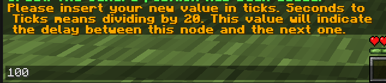
### 第六步
点击之前编辑的节点右侧的节点。
现在走到你希望摄像机所在的位置。您可以使用观众模式获得更精确的效果。
然后使用`/cinematic input move 40 precise`命令确认。
这将使从第一个摄像机位置到当前位置的动画变得流畅。
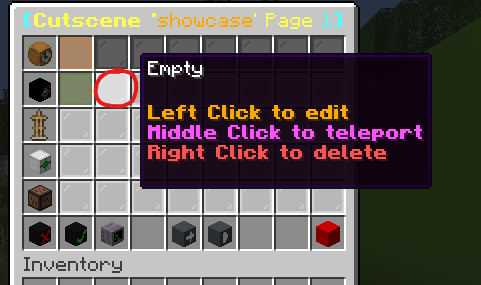
### 第七步
点击新摄像机位置上方的节点，再次写入 "100"。
这将使动画等待 100 秒后结束，而不是在到达新摄像机位置后立即结束。
### 第八步
点击播放按钮（底部）开始播放剪辑。如果您的操作正确，您现在应该有一个在这两个位置之间平滑平移的摄像机路径！
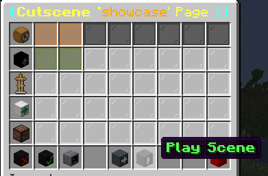
### 演示视频

<iframe width="560" height="315" src="https://www.youtube.com/embed/gUoOeuzQvQc" title="YouTube video player" frameborder="0" allow="accelerometer; autoplay; clipboard-write; encrypted-media; gyroscope; picture-in-picture; web-share" allowfullscreen></iframe>

## 特效

> 这些特效需要资源包才能使用。

从这里下载：



### 镜头切换间的淡入淡出
#### 第一步
在动画开始处添加一个新这是一个   ，然后选择命令并在聊天中写入该。
```
title %player% times 20 20 20
```
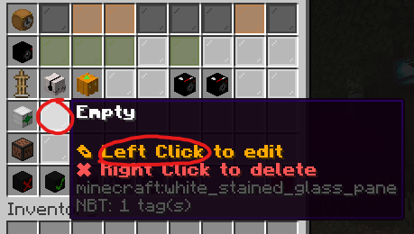
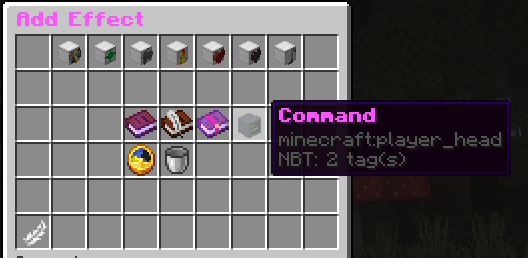
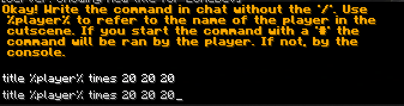

#### 第二步
在动画开始处添加一个新 ，然后选择命令并在聊天中写入该。
```
title %player% title {"text":"A","font":"cinematics:various"}
```
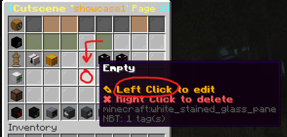

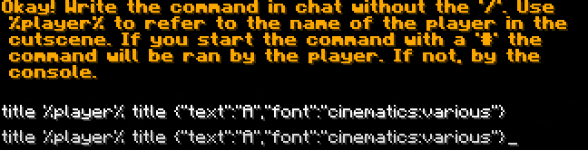

信箱（黑条）
资源包提供了雕刻南瓜（Carved Pumpkin）特殊纹理来创建信箱效果。
要触发此效果，您必须在时间轴编辑器中启用它。

#### 大功告成

<iframe width="560" height="315" src="https://www.youtube.com/embed/yv-4vQQK1x4" title="YouTube video player" frameborder="0" allow="accelerometer; autoplay; clipboard-write; encrypted-media; gyroscope; picture-in-picture; web-share" allowfullscreen></iframe>

## NPC皮肤
### 创建NPC皮肤
为了给您的玩家NPC添加自定义皮肤，您必须使用本网站：



### 选择一个皮肤文件
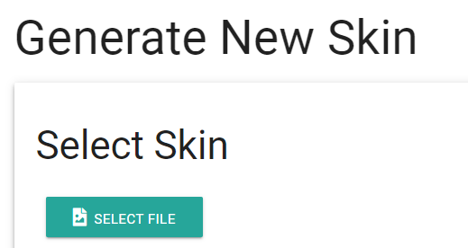
### 按生成
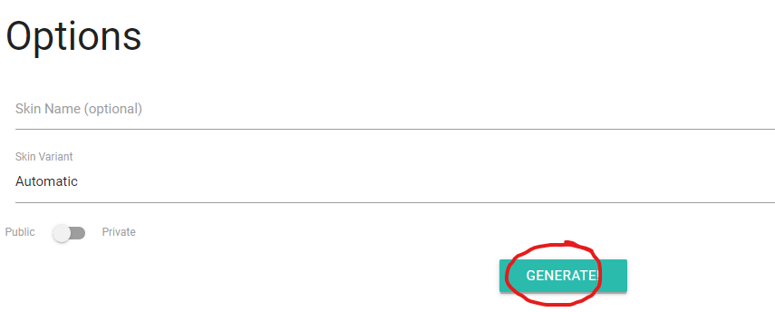
### 复制第一个URL并在CinematicsStudio插件中使用。
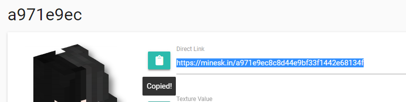
## 服务条款
购买前请记住
- ⛔**在寻求支持之前，请阅读维基百科。**
- ⛔ 您必须对如何**创建/管理/合并插件**和动画**有一定的了解**。**如果你没有这方面的知识**，请不要购买插件。
- ⛔我不知道这个插件是否与任何其他插件干扰，这是不可能知道，没有测试每一个插件在这个星球上，所以如果插件不工作与您的服务器设置，不要求退款，但试图找到原因。

## 开发者API
将JAR导入到您的项目中，并使用该类：
`dev.lone.cinematicstudio.api.CinematicStudioAPI`
### Maven
```java
<dependency>
    <groupId>libs</groupId>
    <artifactId>CinematicStudio</artifactId>
    <version>1.0</version>
    <scope>system</scope>
    <systemPath>JARS_DIRECTORY/plugins/CinematicStudio.jar</systemPath>
</dependency>
```

请不要在您的git推送中包含CinematicStudio.jar。
如果该jar文件在您的项目文件夹中，请使用.gitignore文件来避免。


## 常见问题
### 不需要的NPC动画
我经常收到NPC在录制动作捕捉后表现怪异的信息。
这是因为您选择了一个 "特殊 "库存插槽。
请在录制时查看记分板，因为某些插槽用于创建特殊姿势，例如让您的NPC躺在地板上。
如果您想在动画中使用剑和物品，您必须只使用最后一个热栏插槽。
第一个插槽保留给特殊动画。

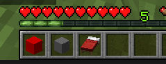
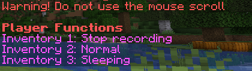

### "您发送了太多的数据包，:("
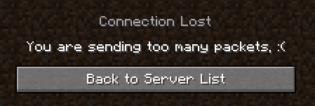

```
tracking-warning-pps: 500
```
> 使用 /viaversion reload 命令

### 旋转卡顿（平滑模式）
这是无法修复的，游戏就是这样运行的。
摄像机角度由游戏近似处理。
唯一能使摄像机角度精确的方法是使用精确摄像机模式，而不是平滑模式。
请确保使其非常慢。将其速度设置为500，这样就不会出现过快的移动。

### 动作卡顿（精确模式）
请务必使其非常慢。将其速度设置为500，这样就不会出现过快的动作。